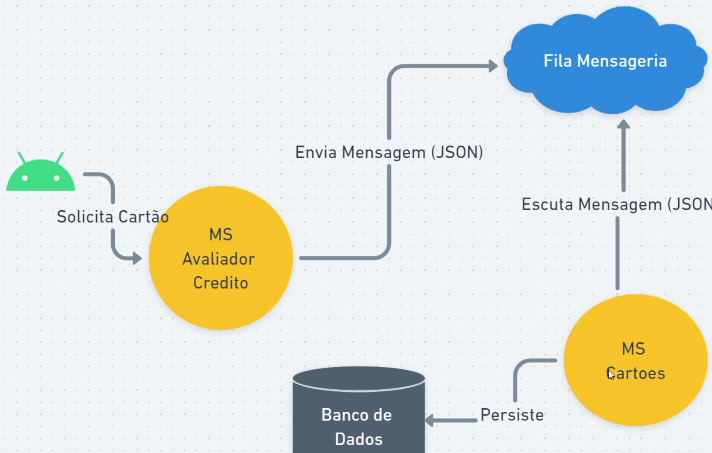

# Microsserviços

## Ordem de deploy das aplicações
- eureka server
- ms gateway
- ms clientes

## Modelo dos microserviços


## Modelo de mensageria



## URLs
- [EurekaServer](http://localhost:8761/)

- Roda aplicação Spring via linha de comando
```
./nvmw spring-boot:run
```

## RabbitMQ
```
docker run -it --name microservico-rabbitmq -p 5672:5672 -p 15672:15672 rabbitmq:3.9-management

usuário: guest
senha: guest
```
