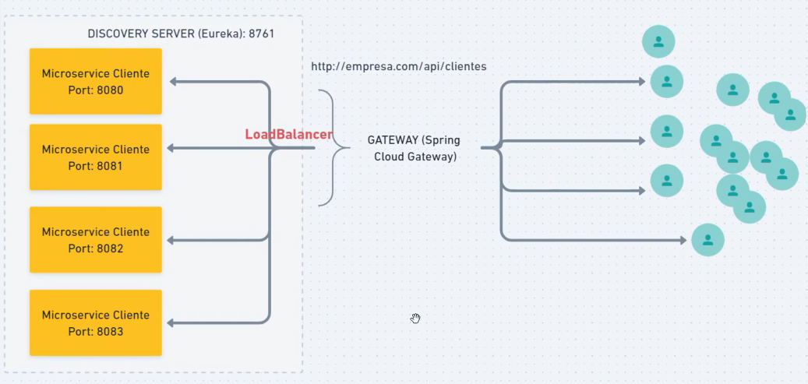

# Microsserviços

## Ordem de deploy das aplicações
- eureka server
- ms gateway
- ms clientes

## Modelo



## URLs
- [EurekaServer](http://localhost:8761/)

- Roda aplicação Spring via linha de comando
```
./nvmw spring-boot:run
```